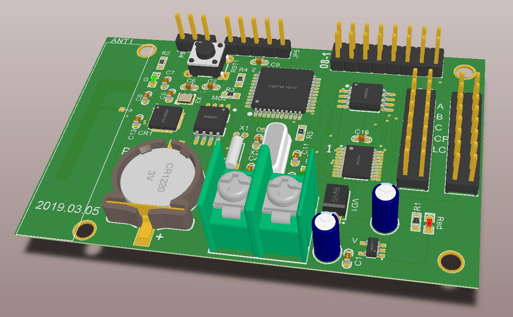
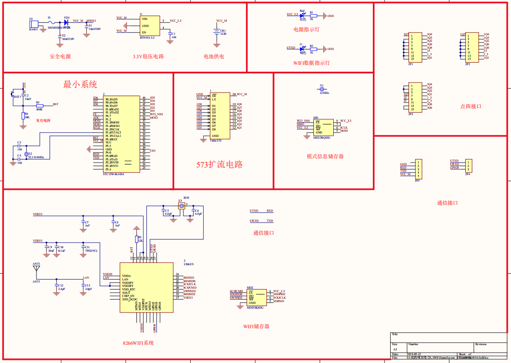

### WIFI显示屏控制器
本人大四时帮助朋友绘制的一块点阵显示器控制板。

WIFI显示屏控制器的本设计主要任务是设计一套完整的硬件控制器以及软件控制程序，所要控制的对象是一组分辨率为16*256和32*512的中号LED广告显示屏，最终使得能够控制16*256和32*512LED广告显示屏显示图文，要求在目测条件下LED广告显示屏各点亮度充足、清晰、均匀。模仿视频编辑中的移入移出等等文字动态效果，来提高观感体验。本设计其中一部分重点介绍了单片机对LED点阵屏的控制原理、控制电路方案、实际驱动电路的设计，并根据驱动LED点阵屏的硬件缺点， 对其控制程序实现的算法进行合理的优化，层层的函数封装，给出了具体的实现程序。

#### PCB 3D预览图

#### 原理图

